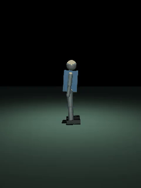
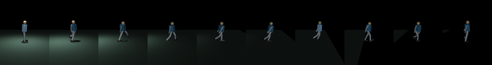

# Mini Humanoid RL — Learning to Walk from Scratch

[](https://github.com/yasincavusoglu/mini-humanoid-rl/actions/workflows/policy-check.yml)
[](LICENSE)
[](https://www.python.org/)

A **20-DOF mini humanoid** (~0.55 m, ~3 kg) that **learns to walk with Reinforcement Learning**, trained in [MuJoCo](https://mujoco.org/) with [PPO](https://stable-baselines3.readthedocs.io/) and bridged to a ROS 2 / Gazebo stack for sim-to-real validation. Built end-to-end: robot model, RL environments, reward engineering, a torch-free deployment path, and a local-LLM task planner.



> The gait above is **not scripted** — it is a neural-network policy that discovered how to walk by trial and error over ~8M simulation steps.

---

## Highlights

- **From hopping to a natural walk.** The final policy walks upright, alternates both legs, bends hips and knees, and stays on its feet — reached through **10+ reward-shaping iterations**, each fixing a specific failure (hopping → shuffling → ankle-cheating → wide stance → side-sway).
- **Phase-clock locomotion.** Uses a periodic phase signal (Siekmann/Cassie-style) so the policy learns a *scheduled* left/right gait cycle instead of a random shuffle.
- **Torch-free deployment.** The trained PPO network + observation normalization are exported to a pure-NumPy `.npz`, so the "robot brain" runs inside ROS 2's system Python with **no PyTorch dependency** (verified bit-exact against Stable-Baselines3, max action diff ≈ 6e-7).
- **Honest sim-to-real.** A full ROS 2 / Gazebo bridge (URDF, `ros2_control`, IMU, odometry, 53-D phase observation) is wired and verified in software; the remaining physics gap is documented openly rather than hidden.

## Final policy (`yuru10`) — measured over 600 steps

| Metric | Result |
|---|---|
| Falls | **0** |
| Forward speed | ~0.34 m/s |
| Gait | alternating left/right, learned phase clock |
| Both-feet-airborne (hopping) | 0 % |
| Hip swing / knee bend | 69–74° / 44–45° |
| Posture | upright (~1° torso lean) |



---

## How it works

```
MuJoCo (physics) ──> Gym env (obs 53-D: state + phase clock) ──> PPO / SB3 (train)
                                                                      │
                                              policy_yuru10.zip + VecNormalize
                                                                      │
                                              export_policy_numpy.py  ▼
                                              politika_yuru10_numpy.npz  (pure NumPy)
                                                                      │
                              ┌───────────────────────────────────────┤
                              ▼                                        ▼
                  MuJoCo live viewer / gait analysis        ROS 2 node (torch-free)
                                                             └─> Gazebo (URDF + ros2_control)
```

- **`envs/`** — Gym environments. The locomotion reward combines a phase-schedule term, foot-clearance, knee-bend, hip-stride, forward-velocity and uprightness rewards against anti-slip, anti-lean, anti-sway and energy penalties. The iteration history (`yuru2` … `yuru10`) is preserved to show the reward-engineering journey.
- **`scripts/`** — training (`train_ppo.py`), gait analysis + video (`13_gait_tam.py`), a live 3-D viewer (`14_canli_izle.py`), the NumPy exporter, and step-by-step teaching demos (`01_hello_mdp.py` → `11_tanima_demo.py`).
- **`ros2/`** — the torch-free policy runner and Gazebo helpers.
- **`gazebo/`** — URDF (MJCF's ROS/Gazebo twin), controllers, and launch files.
- **`cognitive/`** — a local-LLM task planner that maps high-level commands to robot skills.
- **`models/`** — the MJCF robot, trained policies, and the NumPy export. The shipped
  checkpoints are the ones the docs reference (`yuru10` final walk, `yuruyus`, `yuruyus_dr`,
  `denge`); the intermediate reward-iteration checkpoints are not committed, to keep the clone
  small. Every iteration's **environment** (`envs/`) and **gait video** (`videos/`) is in the
  repo, and any of them can be retrained with `train_ppo.py --env yuruN`.

## Quickstart

```bash
# 1) Environment
python3 -m venv .venv && source .venv/bin/activate
pip install -r requirements.txt

# 2) Train a walking policy (CPU is fine — MLP policy)
python scripts/train_ppo.py --env yuru10 --steps 8000000 --n_envs 6 --subproc

# 3) Analyze the gait (metrics + video + frame strip)
python scripts/13_gait_tam.py --pol yuru10

# 4) Watch it live in 3-D (needs a display + GPU)
python scripts/14_canli_izle.py --pol yuru10

# 5) Export the brain to torch-free NumPy (for ROS 2)
python scripts/export_policy_numpy.py --env yuru10
```

## Sim-to-real: what works, what doesn't

The MuJoCo-trained policy and the **software** bridge (observation layout, NumPy inference, phase clock, URDF + controllers) are complete and verified. Making the robot **physically walk in Gazebo** is deliberately left as an open capstone: it needs (1) ROS 2 `gazebo_ros2_control` plumbing fixes and (2) closing the MuJoCo↔Gazebo physics gap (actuator-gain matching + domain-randomized retraining). This is documented in [`gazebo/README.md`](gazebo/README.md) rather than glossed over — the sim-to-real gap is the honest hard part of the project.

## Tech stack

MuJoCo · Stable-Baselines3 (PPO) · Gymnasium · NumPy · ROS 2 Humble · Gazebo Classic + `ros2_control` · Python

## Author

**Yasin Çavuşoğlu** — Computer Vision / Autonomous Systems Engineer.
Built as a self-directed end-to-end robotics-learning project (robot design → RL → deployment).

---

*Note: internal identifiers are in Turkish (e.g. `yuru` = walk, `denge` = balance, `odul` = reward); code comments and docs are in English.*
